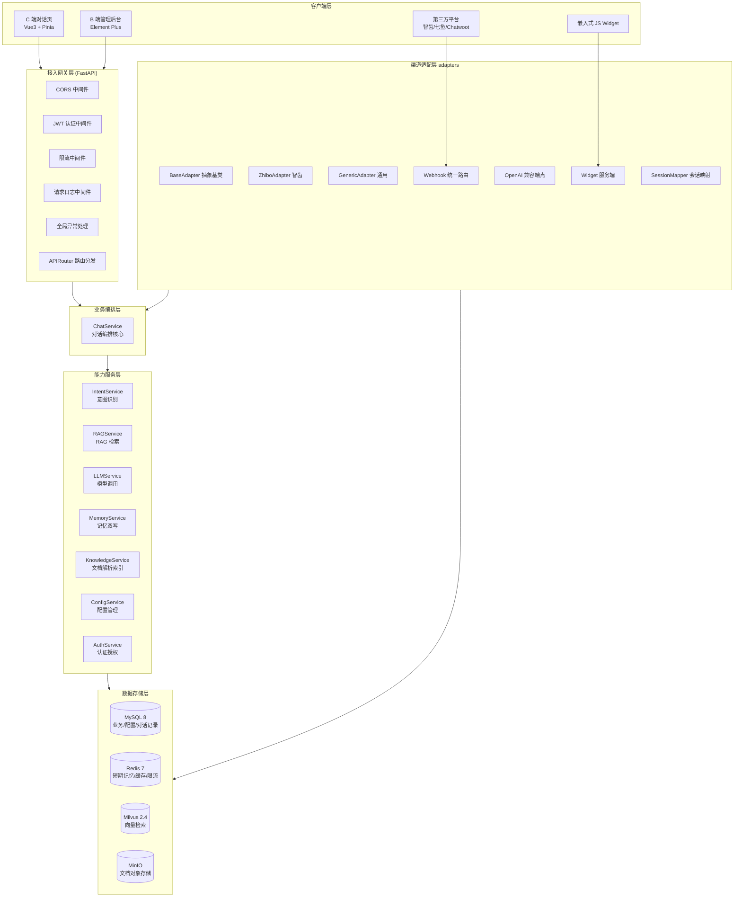
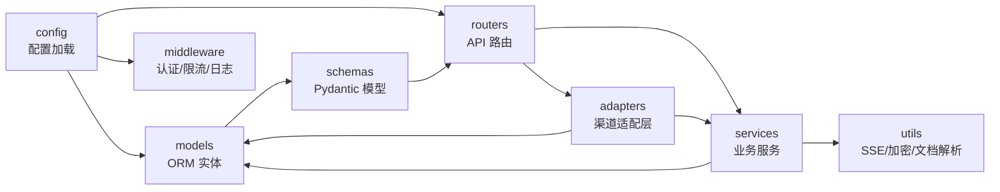
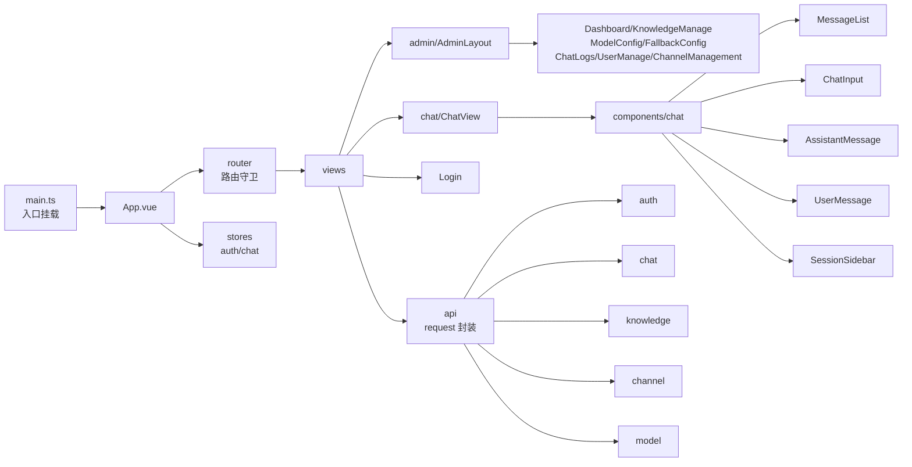
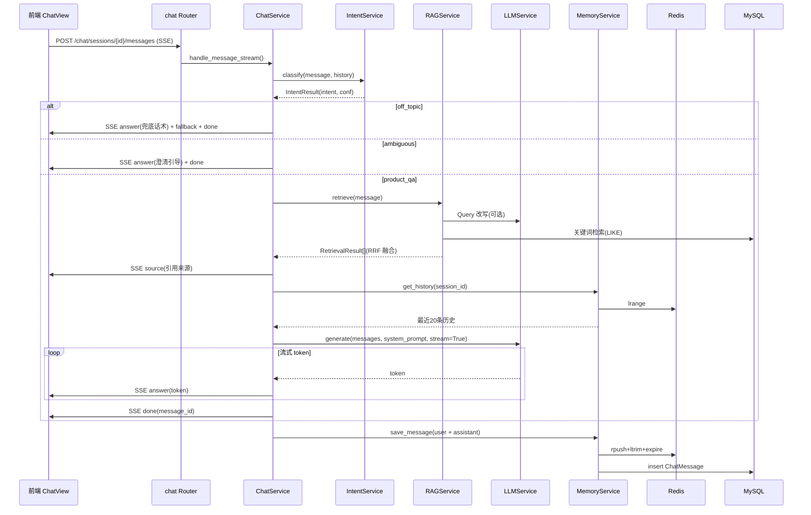
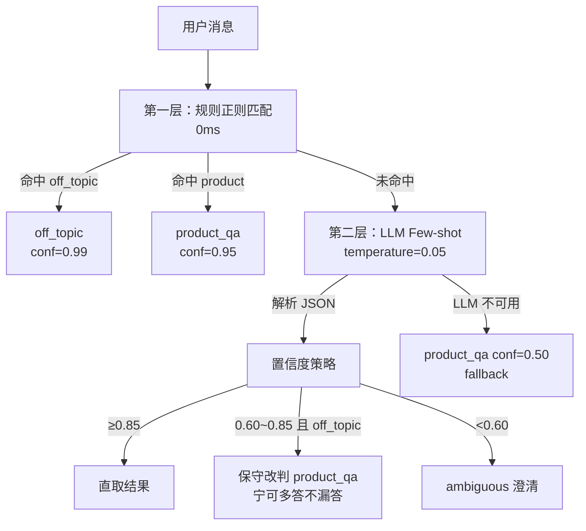
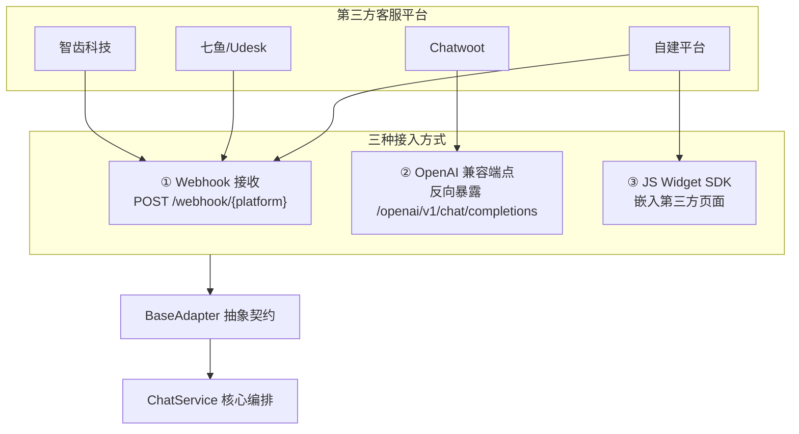
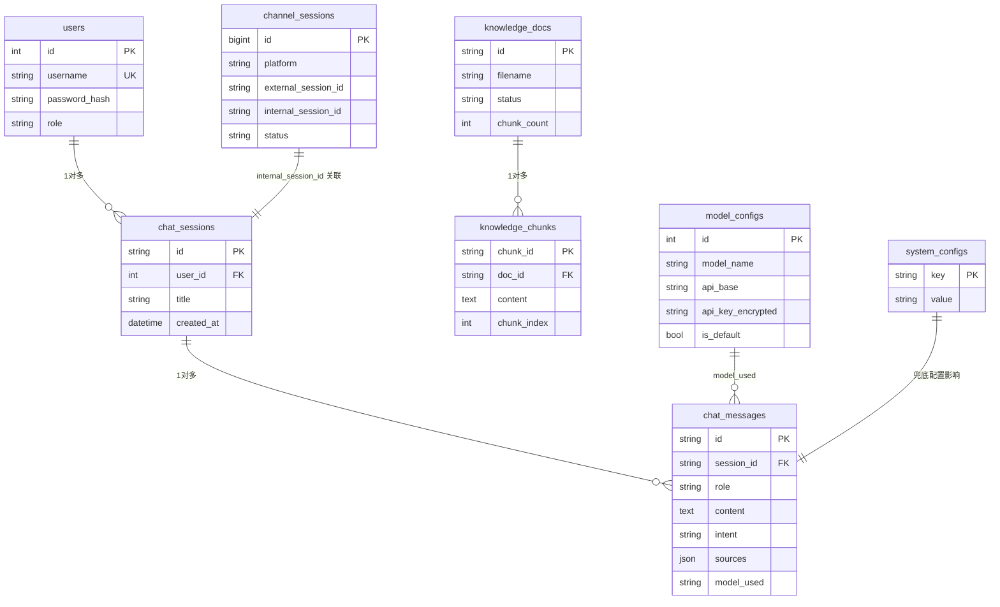

 # AI 出图产品智能客服 Agent · 框架设计文档

> 项目根路径：`c:\Users\admin\Desktop\ZNKF\ZNKF\ZNKF\a1\KF2`
> 技术栈：Python 3.13 / FastAPI / SQLAlchemy 2.0 / Vue 3.4 / TypeScript 5 / MySQL 8 / Milvus 2.4 / Redis 7 / MinIO
> 文档定位：基于代码现状逆向梳理的「系统框架设计」，覆盖整体架构、分层职责、核心流程、数据存储、扩展点

---

## 一、项目概述

### 1.1 项目定位

一套面向 AI 出图产品的全栈智能客服解决方案，为 C 端用户提供基于知识库的智能问答，同时为运营人员提供知识库管理、模型配置、对话记录审计等后台能力。系统通过「渠道适配层」可对接智齿、七鱼、Udesk、Chatwoot 等第三方客服平台，做到 Agent 核心与外部渠道解耦。

### 1.2 核心能力矩阵

| 能力 | 实现要点 |
|------|----------|
| 意图识别 | 规则引擎正则（0ms）+ LLM Few-shot 双层判断，置信度策略兜底 |
| RAG 检索 | 向量检索（Milvus COSINE）+ 关键词检索（MySQL LIKE）RRF 融合 + Query 改写 |
| 多模型调用 | OpenAI 兼容协议统一封装，DB 模型配置热切换，失败自动降级 mock |
| 流式对话 | Server-Sent Events 实时流式输出 + Markdown 渲染 + 引用来源标签 |
| 兜底引导 | 非产品问题输出引导话术，提供转人工入口与客服电话 |
| 对话记忆 | Redis 短期记忆（TTL 24h，最近 20 条）+ MySQL 长期持久化双写 |
| 渠道适配 | Webhook / OpenAI 兼容端点 / JS Widget 三层混合接入方案 |

### 1.3 用户角色

- **C 端用户**：通过对话窗口或嵌入式 Widget 提问
- **运营/管理员**：管理知识库、配置模型与话术、查看对话记录
- **第三方平台**：通过 Webhook 推送用户消息并接收 Agent 回复

---

## 二、整体架构设计

### 2.1 系统全景

系统采用前后端分离 + 多存储分层架构，自上而下分为：前端表现层、接入网关层、业务编排层、能力服务层、数据存储层。



### 2.2 分层职责边界

| 层级 | 职责 | 不做 |
|------|------|------|
| 接入网关层 | 认证、限流、CORS、日志、异常兜底、路由分发 | 业务逻辑 |
| 业务编排层 | 串联意图→RAG→LLM→兜底→记忆的完整流程，SSE 事件编排 | 直接操作存储细节 |
| 能力服务层 | 单一能力封装（意图/检索/生成/记忆/配置），可独立复用 | 跨能力编排 |
| 渠道适配层 | 屏蔽第三方平台差异，统一消息收发契约 | 业务决策 |
| 数据存储层 | 持久化与检索，提供 async 接口 | 业务规则 |

---

## 三、后端分层架构

后端采用经典分层：`config → models → schemas → middleware → routers → services → adapters → utils`，遵循单向依赖（上层依赖下层，不反向引用）。



### 3.1 配置层 `app/config`

集中管理所有外部连接与运行参数，基于 Pydantic Settings 从 `.env` 加载，支持环境变量覆盖。

| 模块 | 职责 |
|------|------|
| [settings.py](file:///c:/Users/admin/Desktop/ZNKF/ZNKF/ZNKF/a1/KF2/ai-customer-backend/app/config/settings.py) | 全局配置单例，含 DB/Redis/Milvus/MinIO/LLM/JWT/限流/RAG/渠道适配等全部参数，提供派生属性（async_database_url、redis_url、cors_origins_list）|
| database.py | 异步引擎 `create_async_engine` + `AsyncSessionLocal`，开发环境 create_all 建表，生产用 Alembic |
| redis.py | aioredis 连接 + ping 健康检查 |
| milvus.py | Milvus 连接 + 集合 schema 确保（COSINE 度量） |
| minio.py | MinIO 客户端 + bucket 自动创建 |

**设计要点**：降级优先。所有外部依赖（Milvus/MinIO/Redis）在 Lifespan 中初始化失败仅告警不阻断启动，保证开发环境轻量可用。

### 3.2 数据模型层 `app/models`

8 张核心表，SQLAlchemy 2.0 Mapped 注解风格。

| 模型 | 表 | 职责 |
|------|----|------|
| User | users | 用户账号（admin/user 角色） |
| ChatSession | chat_sessions | 内部对话会话 |
| ChatMessage | chat_messages | 对话消息记录（含 intent/sources/model_used） |
| KnowledgeDoc | knowledge_docs | 知识库文档元信息 |
| KnowledgeChunk | knowledge_chunks | 文档分块（chunk_id 与 Milvus 对齐） |
| ModelConfig | model_configs | LLM 模型配置（api_key 加密存储） |
| SystemConfig | system_configs | 系统键值配置（兜底话术、RAG 参数等） |
| ChannelSession | channel_sessions | 外部平台 ↔ 内部会话双向映射（platform + external_session_id 唯一约束） |

### 3.3 请求/响应模型层 `app/schemas`

Pydantic v2 模型，负责入参校验与出参序列化，与 ORM 实体解耦。

| 模块 | 内容 |
|------|------|
| auth.py | 登录/注册/Token 响应 |
| chat.py | 会话 CRUD、SSEEvent（source/answer/fallback/done/error）、SourceItem |
| knowledge.py | 文档上传/列表/分块查询 |
| admin.py | 模型配置、系统配置、渠道管理 |
| webhook.py | WebhookAck/WebhookHealth 统一应答 |
| common.py | 通用分页/统一响应包装 |

### 3.4 路由层 `app/routers`

统一 `/api/v1` 前缀挂载，按职责切分 10 个 Router：

| Router | 前缀 | 鉴权 | 职责 |
|--------|------|------|------|
| auth | /auth | 白名单 | 登录/注册/me |
| chat | /chat | JWT | 会话 CRUD + SSE 流式对话 |
| admin_knowledge | /admin/knowledge | JWT+admin | 文档上传/解析/删除/重建索引 |
| admin_config | /admin/config | JWT+admin | 模型配置/系统配置 CRUD |
| admin_chat_logs | /admin/chat-logs | JWT+admin | 对话记录查询/导出 |
| admin_users | /admin/users | JWT+admin | 用户管理 |
| admin_channel | /admin/channels | JWT+admin | 渠道配置 CRUD + 会话记录 |
| webhook | /webhook | HMAC | 第三方 Webhook 接收 |
| openai_compat | /openai | API Key | OpenAI 兼容反向端点 |
| widget | /widget | app_key | JS Widget 嵌入服务端 |

### 3.5 业务服务层 `app/services`

系统的核心能力封装，采用构造注入依赖（无框架级 IoC 容器，手动组装依赖链）。

| 服务 | 依赖 | 职责 |
|------|------|------|
| **ChatService** | Intent/RAG/LLM/Memory/Config | 对话编排核心，串联完整流程，yield SSEEvent |
| IntentService | LLM | 规则正则 + LLM 双层意图分类，置信度策略 |
| RAGService | DB/Config/LLM | 向量+关键词混合检索，RRF 融合，Query 改写 |
| LLMService | Config | OpenAI 兼容协议，流式/非流式，mock 降级 |
| MemoryService | DB+Redis | 对话记忆双写（Redis 滑动窗口 + MySQL 持久化）|
| KnowledgeService | DB/Milvus/MinIO | 文档解析、分块、向量化入库 |
| ConfigService | DB | 模型配置/系统配置读写 + API Key 解密 |
| AuthService | DB | 注册/登录/JWT 签发，含降级用户 fallback |

### 3.6 中间件层 `app/middleware`

| 中间件 | 顺序 | 职责 |
|--------|------|------|
| CORSMiddleware | 最外层 | 跨域放行，暴露限流/响应时间响应头 |
| AuthMiddleware | 次外层 | JWT 校验，支持 `**` 跨段通配白名单，渠道层走自身鉴权 |
| RateLimiterMiddleware | 业务前 | Redis 计数限流（默认 600/min） |
| LoggingMiddleware | 业务前 | 请求/响应日志 + 响应时间统计 |
| ExceptionHandler | 最内层 | 统一异常包装为标准响应体 |

### 3.7 工具层 `app/utils`

| 模块 | 职责 |
|------|------|
| sse.py | SSE 事件构造器（make_answer/source/fallback/done/error_event）|
| crypto.py | Fernet 对称加密，用于 ModelConfig.api_key 落库加密 |
| document_parser.py | PDF/Word/TXT/MD 解析 + langchain 分块 |

---

## 四、前端架构

### 4.1 技术栈

Vue 3.4 + TypeScript 5 + Vite 5 + Element Plus + Pinia + TailwindCSS + SCSS。Markdown 渲染依赖 markdown-it + highlight.js。

### 4.2 目录与模块



### 4.3 路由与权限

- 路由守卫三重校验：`requiresAuth`（登录）→ `requiresAdmin`（管理员）→ 标题设置
- `/chat`：C 端对话页（普通用户）
- `/admin/*`：B 端管理后台（admin 角色），含 7 个子页（仪表盘/知识库/模型/兜底话术/对话记录/用户/渠道）
- `/login`：登录页

### 4.4 状态管理

- `auth.ts`：token、userInfo、isAdmin，封装 fetchMe
- `chat.ts`：会话列表、当前会话、消息列表（兼容后端分页 `{list, total}` 响应），SSE 流式 token 拼接

### 4.5 API 请求层

`request.ts` 统一 axios 实例，拦截器注入 Bearer Token、统一错误处理；按业务域拆分 auth/chat/knowledge/channel/model。

---

## 五、核心业务流程

### 5.1 C 端流式对话主流程



**关键设计**：
- `finally` 块使用独立 `AsyncSessionLocal` 执行双写，避免主会话提前关闭导致写入失败
- SSE 事件类型固定：`source` → `answer`(多次) → `done` / `error`
- 始终保存用户消息；AI 回答为空时跳过但不影响用户消息持久化

### 5.2 意图识别双层策略



### 5.3 RAG 检索流水线

`retrieve()` 八步：Query 改写 → 向量化主查询 → 向量检索 → 关键词检索（可选）→ RRF 融合 → 低分过滤 → 截断 top_k → Re-rank（预留）。降级策略：Milvus 不可用时向量检索跳过，仅靠关键词；Embedding API Key 无效时走确定性 mock 向量。

---

## 六、渠道适配层设计（核心亮点）

### 6.1 设计目标

让 Agent 核心与第三方客服平台解耦，新增平台无需改动核心代码，只需实现适配器并注册。

### 6.2 三层混合接入方案



| 接入方式 | 适用场景 | 鉴权 |
|----------|----------|------|
| Webhook | 平台主动推送用户消息 | HMAC 签名校验 |
| OpenAI 兼容端点 | 平台主动拉取回复（同步） | API Key |
| JS Widget | 嵌入第三方网页 | app_key |

### 6.3 BaseAdapter 契约

适配器基类定义三个抽象方法 + 一组通用辅助：

| 方法 | 类型 | 职责 |
|------|------|------|
| verify_signature | abstract | 验签防伪造 |
| parse_incoming | abstract | 平台消息 → 统一内部格式 dict |
| send_reply | abstract | Markdown 回复 → 平台原生格式 |
| format_sources / format_fallback / build_final_content | 通用 | 回复文本组装 |
| transfer_to_human / send_typing_indicator / close_session / mark_read | 可选覆写 | 平台特有能力探测 |

### 6.4 适配器注册工厂

`platforms/__init__.py` 维护 `_ADAPTER_REGISTRY` 注册表，`get_adapter(platform)` 单例工厂，未注册平台兜底到 `GenericAdapter`。新增平台三步：建文件→实现三方法→注册表登记。

### 6.5 Webhook 处理流程（9 步）

启用检查 → 获取适配器 → 读 raw_body → 验签 → 解析 → skip 过滤 → 防重复（内存缓存 message_id，TTL 5min）→ 会话映射 → 后台异步处理 → 立即返回 202。异步处理使用 `BackgroundTasks` + 独立 `AsyncSessionLocal` 构建完整 ChatService 依赖链，避免阻塞 Webhook 响应。

### 6.6 会话映射器 SessionMapper

维护 `ChannelSession` 表的双向映射：`(platform, external_session_id)` 唯一约束 → `internal_session_id`。`get_or_create` 幂等，支持渠道会话与内部会话的解耦关联。

---

## 七、数据存储设计

### 7.1 多存储分工

| 存储 | 角色 | 内容 |
|------|------|------|
| MySQL | 唯一真相源 | 业务实体、配置、对话记录、渠道映射 |
| Redis | 高速缓存 | 短期对话记忆（滑动窗口）、限流计数、配置缓存 |
| Milvus | 语义检索 | 知识分块向量（COSINE 度量，1024 维） |
| MinIO | 文件存储 | 原始文档对象（知识库上传源文件） |

### 7.2 双写一致性策略

对话记忆采用 Redis 短期 + MySQL 长期双写：Redis 保障高频读取性能（lrange 最近 20 条），MySQL 保障持久化与审计。写入顺序 Redis 先行（rpush+ltrim+expire），MySQL 异步插入；读取优先 Redis，失败不阻断。ChatService 在 `finally` 块用独立 session 写入，保证即使主流程异常也能落库用户消息。

### 7.3 表关系



---

## 八、关键设计原则

### 8.1 降级优先

所有外部依赖（Milvus/MinIO/Redis/LLM/Embedding）失败均不阻断主流程，提供 mock 降级：
- LLM API Key 无效 → 本地 mock 回复（关键词匹配 + 模拟流式）
- Embedding 无效 → 确定性伪随机向量（相同文本相同向量，可检索）
- Milvus 不可用 → 仅关键词检索
- Redis 不可用 → MySQL 直读
- DB 不可用 → 降级用户鉴权 fallback

### 8.2 解耦与可扩展

- 渠道适配层：新增平台不动核心，三步注册
- LLMService：OpenAI 兼容协议统一，多模型 DB 热切换
- ChatService：能力服务构造注入，可替换任意子服务
- 配置全量环境变量化：`.env` + Pydantic Settings，无硬编码

### 8.3 流式优先

C 端对话统一 SSE 流式输出，事件类型固定（source/answer/fallback/done/error），前端按事件增量渲染。渠道适配层通过 `handle_message_sync` 收集流式结果转为同步响应。

### 8.4 幂等与防重

Webhook 入口内存缓存 message_id 防重（TTL 5min）；`SessionMapper.get_or_create` 幂等；默认账号初始化幂等（仅当不存在时创建）。

---

## 九、扩展性与演进

### 9.1 当前已实现

- 核心 P0：意图/RAG/LLM/兜底/SSE/记忆
- P1：知识库后台、模型切换、渠道适配层（智齿+通用）、Widget SDK
- 数据库迁移 Alembic、Makefile/Docker 化运行

### 9.2 预留扩展点

| 扩展点 | 现状 | 演进方向 |
|--------|------|----------|
| Re-rank | `_rerank` 直接返回 | 接入 BGE-Reranker-v2-m3 Cross-Encoder |
| 适配器 | zhibo/generic | 补充 qiyu/udesk/chatwoot/zendesk |
| 认证 | JWT + 降级用户 | RBAC 权限矩阵、SSO 接入 |
| 仪表盘 | 占位 | 对话量/意图分布/命中率统计 |
| 用户反馈 | 未实现 | 问答点赞/点踩、反馈收集 |
| 部署 | 本地/Makefile | Docker Compose 一键编排、K8s |

### 9.3 配置化驱动

运行时参数（RAG top_k、score 阈值、混合检索开关、Query 改写开关、兜底话术、限流上限、模型默认配置）均通过 `SystemConfig` 表 + `ConfigService` 动态读取，后台可热修改，无需重启。

---

## 十、目录结构总览

```
KF2/
├── CODE_WIKI_完整文档2.0.md          # 权威代码知识库
├── 说明文档.md                       # 项目生命周期管理文档
├── 框架设计文档.md                   # 本文档
├── ai-customer-backend/              # 后端
│   ├── app/
│   │   ├── main.py                   # FastAPI 入口 + Lifespan
│   │   ├── config/                   # 配置层
│   │   ├── models/                   # ORM 实体（8 表）
│   │   ├── schemas/                  # Pydantic 模型
│   │   ├── middleware/              # 认证/限流/日志/异常
│   │   ├── routers/                  # API 路由（10 个）
│   │   ├── services/                 # 业务服务（8 个）
│   │   ├── adapters/                 # 渠道适配层
│   │   │   ├── base.py               # BaseAdapter 抽象基类
│   │   │   ├── platforms/            # 平台适配器 + 注册工厂
│   │   │   ├── webhook_router.py     # Webhook 统一路由
│   │   │   ├── openai_compat.py      # OpenAI 兼容端点
│   │   │   ├── session_mapper.py     # 会话映射器
│   │   │   ├── response_adapter.py   # SSE 事件收集
│   │   │   └── widget/               # JS Widget 服务端 + SDK
│   │   └── utils/                    # SSE/加密/文档解析
│   ├── alembic/                      # 数据库迁移
│   ├── data/                         # SQLite 降级 + Milvus Lite
│   └── requirements.txt
├── ai-customer-frontend/             # 前端
│   ├── src/
│   │   ├── main.ts / App.vue
│   │   ├── router/                   # 路由 + 权限守卫
│   │   ├── stores/                   # Pinia (auth/chat)
│   │   ├── api/                      # axios 请求层
│   │   ├── views/                    # chat + admin + login
│   │   ├── components/               # chat + common 组件
│   │   └── utils/                    # markdown/sse/format
│   └── package.json
└── scripts/                          # 运维/测试脚本
```

---

